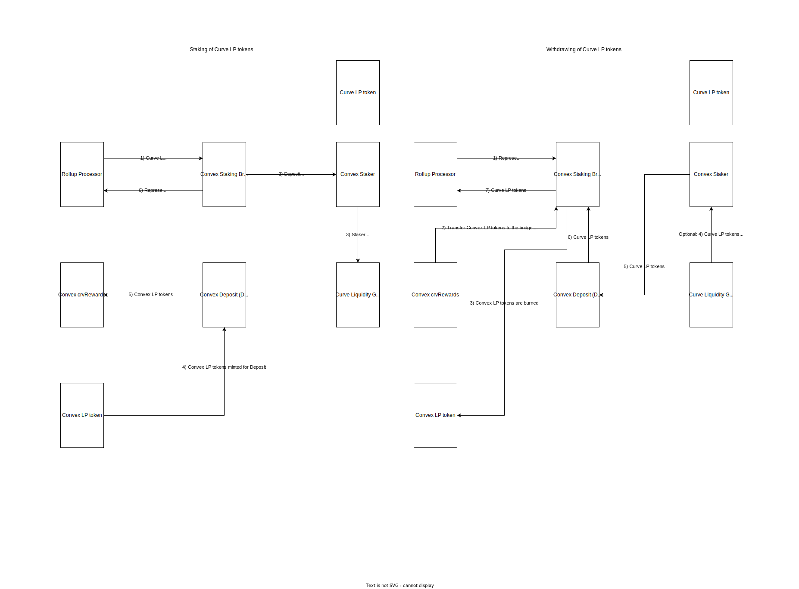

# Spec for Convex Staking Bridge

## What does the bridge do? Why build it?

The bridge stakes Curve LP tokens via Convex Finance. Convex Finance Booster stakes Curve LP tokens provided by the user and mints its own pool specific Convex LP tokens for the user to keep track of the staked Curve LP tokens and the earned rewards.

The advantage of staking on Convex Finance over Curve Finance is that the user earns boosted CRV rewards right away and can withdraw the staked tokens any time. On top of this, the user earns CVX (Convex tokens) and at some pools even additional rewards.

## What protocol(s) does the bridge interact with ?
The bridge interacts with two protocols. Primarily with Convex Finance that operates with the given Curve LP tokens on Curve.

[Convex Finance](https://www.convexfinance.com/) is a protocol built on top of Curve to make yield farming much easier and to automatically get boosted rewards. Convex Finance allows staking of CRV tokens or Curve LP tokens on Curve Finance without the need to lock user's CRV away and the user can start earning boosted CRV right away. This bridge only works for staking of Curve LP tokens.
Note: Convex Finance has its own governance token CVX which user earns as part of staking.

[Curve](https://curve.fi/) is a AMM that specializes in pools with low internal volatility (stableswap). Curve Finance provides us with many LPs to which a user may provide liquidity and earn rewards. Rewards are paid out in tokens specific to the LP and/or pool specific `Curve LP tokens`. To be able to utilize the full potential of the earned LP tokens, it is necessary to stake them. Here comes in play Convex Finance.

## What is the flow of the bridge?

There are two flows of Convex staking bridge, namely deposits and withdrawals.

### Deposit (Stake)

TL;DR: Bridge stakes Curve LP tokens into Curve pool liquidity gauge contract via Convex Finance Booster. Subsequently new Convex LP tokens of the corresponding pool are minted in 1:1 ratio and transferred to crvRewards contract. Bridge creates a new interaction representing the staked Curve LP tokens and serves as a proof of this transaction that can be later used to withdraw.

Bridge expects Curve LP token on input and virtual asset on output in order to perform deposit. Curve LP tokens are transferred from Rollup Processor to the bridge. Bridge loads all pools that Convex Finance supports and finds a pool that corresponds to the Curve LP token on input. If no matching pool is found, transaction fails. Convex Finance has a Booster contract operating across all the pools. Booster handles the complete deposit (staking) process and is approved to handle bridge's Curve LP tokens. First, it transfers the Curve LP tokens into Staker contract that then stakes them to Liquidity Gauge of the specific pool. New Convex LP tokens are minted, representing the staked LP tokens on Convex network in 1:1 ratio. Convex LP tokens are transferred to Convex crvRewards contract. CrvRewards is now in possession of the minted Convex LP tokens and through them keeps track of the staked Curve LP tokens for the bridge (or any other staking user). Upon successful staking, bridge logs the information that this amount of Curve LP tokens was staked. This log is then tied with the virtual assets id, thus an `interaction` is created. Interaction serves as a receipt for staked tokens and this receipt is used to claim the staked Curve LP tokens in full upon providing a virtual asset of matching id.

**Edge cases**:
- Convex Finance has to support the Curve LP token you are trying to stake. If no pool matches the provided Curve LP token, no staking will happen.
- Staking amount cannot be zero.
- Pool can be shut down and no staking will happen

### Withdrawal (Unstake)

TL;DR: Bridge withdraws staked Curve LP tokens and optionally staking rewards via Booster. Booster burns representing Convex LP tokens and returns staked Curve LP tokens to the bridge which are then recovered by Rollup Processor.

Bridge expects virtual asset of a specific id on input and Curve LP token on output to perform withdrawal. Virtual asset id is searched in interactions (proofs of deposits). If correct interaction is found, validation checks are performed. It is necessary to withdraw the same amount of tokens that was deposited because once the interaction is completed, there's no way to claim these tokens back. Withdrawal process consists of two steps. First, the bridge needs to call crvRewards contract to transfer the Convex LP tokens to the bridge and optionally claim rewards. Second, we call the Booster to withdraw the deposited Curve LP tokens. Withdrawal process starts by burning the Convex LP tokens, then retrieves Curve LP tokens from Staker contract. If sufficient funds are not available, Staker pulls more deposited Curve LP tokens from the specific Curve pool liquidity gauge contract. Desired amount of Curve LP tokens is then retrieved and transferred back to the bridge. In the next step, Rollup Processor recovers the Curve LP tokens.
Utilizing auxData we are able to claim rewards at withdrawal. If rewards are to be claimed, boosted CRV tokens, CVX tokens, for some pools some additional rewards are minted for the bridge. However, they will not be recovered by the Rollup Processor.

**Edge cases**
- Withdrawal impossible without staking tokens into the pool first.
- Withdrawal impossible if interaction was already cleared.
- Withdrawal amount has to match amount of tokens staked under the interaction.
- Withdrawal amount cannot be zero.

### General Properties for both deposit and withdrawal
- The bridge is synchronous, and will always return `isAsync = false`.
- Bridge is stateful since information about staking is stored as `interaction`
- Single input asset and single output asset is expected

## Can tokens balances be impacted by external parties, if yes, how?
- Either a single pool or all at the same time can be shut down. This can impact the balances of certain contracts where the tokens typically are, however, do not result in any tokens lost.

- A single pool can be shut down by Booster's Pool Manager contract (0x5F47010F230cE1568BeA53a06eBAF528D05c5c1B)
Any interaction with curve pool supported by Convex Finance can be shut down by Convex pool manager contract. 
Pool shutdown will force all tokens from Staker and Gauge contracts to be transferred to Booster. Withdrawals will no get impaired.
Only the Staker's and Gauge's balances (including your share) are displaced.
Note: Deposit will not be possible.

- All pools can be single handedly shut down by Booster's Owner contract (0x3cE6408F923326f81A7D7929952947748180f1E6)
Does and allows exactly the same thing as shut down of a single pool described above, only for all the pools.

## Is the contract upgradeable?

No, the bridge is immutable without any admin role.

## Does the bridge maintain state?

Yes, the bridge maintains a state - a set of interactions tracing amount of staked Curve LP tokens, address of Convex LP token that was minted and the virtual asset id that the staking belongs to. A new interaction is created for each successful staking action. Interaction lives until claimed - see withdrawal section.
