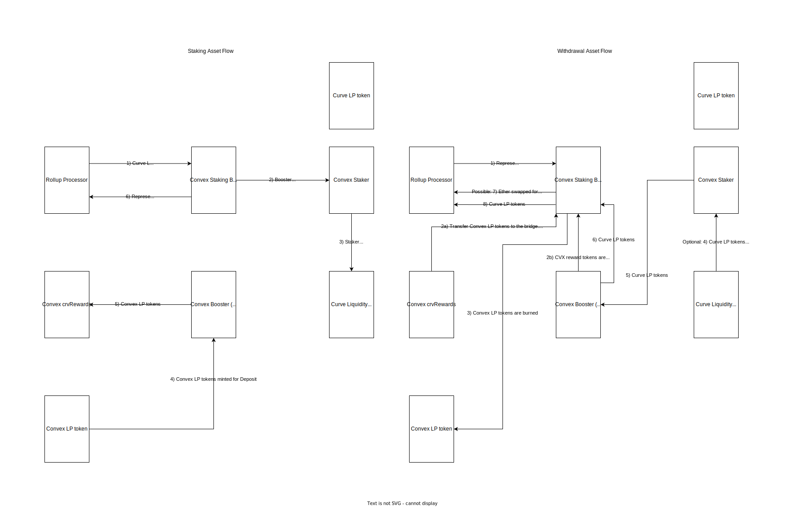

# Spec for Convex Staking Bridge

## What does the bridge do? Why build it?

The bridge stakes convex LP Token into Convex rewards contract and a users earns CVX (Convex tokens) and boosted CRV (Curve tokens) in exchange for Curve LP tokens. On top of that, staking is not timely constrained and user can withdraw their Curve LP tokens any time.

User gets boosted rewards without staking CRV token on Curve.
At some pools user can earn some extra tokens.

(that are given to you as a reward for providing liquidity to Curve LP pools) to 

## What protocol(s) does the bridge interact with ?
The bridge interacts with two protocols. Primarily with Convex that on our behalf operates with Curve LP tokens on Curve.

[Convex](https://www.convexfinance.com/) is a protocol build on top of Curve to make yield farming much easier and to automatically get boosted rewards without having to staking Curve tokens on Curve Finance. Curve Finance UI is rather cumbersome and requires locking of CRV away. Convex allows staking of CRV tokens or Curve LP tokens without the need to lock user's CRV. This bridge only works for staking of Curve LP Tokens. 
Note: Convex Finance has its own governance token CVX which user earns as part of staking.

[Curve](https://curve.fi/) is a AMM that specializes in pools with low internal volatility (stableswap). Curve Finance provides us with many LPs to which a user may provide a liquidity and earn rewards rewarded in a LP specific fee as well as curve LP Token. However, to be able to utilize the full potential of the earned LP tokens, it is necessary to stake them. Here comes in play Convex Finance.  

## What is the flow of the bridge?

There are two flows of Convex staking bridge, namely deposits and withdraws.

## EXTRA not sure if useful, desc from my bridge
* @notice A DefiBridge that stakes Curve LP Token into Convex Finance. Convex Finance transfers Curve LP Tokens 
 * from bridge to a liquidity gauge. New Convex Tokens are minted and then staked (transfered) to CRV Rewards.
 * Bridge mints a matching version of the staked Convex Tokens, CSB Tokens, and assignes their ownership to the RollUpProcessor.
 * At unstaking, both - CSB Tokens and Convex Tokens - are burned and ownership of Curve LP Tokens is given back to the RollUpProcessor.

    Staking: Curve LP Token is then placed into liquidity gauge by pool specific staker contract. 
    New Convex Token is minted and then staked/deposited into rewardsContract.
    Withdrawing of Curve LP Tokens goes in reversed order. First, the minted Convex Tokens will get burned.
    If there is enough Curve LP tokens, tokens will be credited to the bridge. If this is not the case, 
    the necessary rest of Curve LP Token amount will be withdrawn from pool's liquidity gauge contract 
    and subsequently credited to the bridge and back to RollUpProcessor.

    @notice Staking and unstaking of Curve LP Tokens via Convex Finance in a form of Convex Tokens.
    @notice To be able to stake a token, you already need to own Curve LP Token from one of its pools.

### Deposit (Stake)

TL/DR: Bridge deposits Curve LP tokens into Curve pool liquidity gauge contract via Convex Deposit Contract. Subsequently new Convex LP tokens of the corresponding pool are minted in 1:1 ratio and staked into convex crvRewards contract. Bridge creates a new interaction representing the staked Convex LP Tokens and serves as a proof of this transaction that can be later withdrawn.

Bridge expects Curve LP token on input and virtual asset on output in order to perform deposit. Curve LP tokens are transferred from Rollup Processor to the bridge. Bridge loads all pools that Convex Finance supports and finds a pool that corresponds to the Curve LP token on input. If no matching pool if found, transaction fails. Convex Finance has a Deposit contract operating across all the pools. The deposit contract handles the complete deposit (staking) process and is approved to handle bridge's Curve LP tokens. First, it transfers the Curve LP tokens into a Staker contracts that then transfers them to Liquidity Gauge of the specific pool on our behalf. New Convex LP tokens are minted, representing our pool's LP tokens on Convex network in 1:1 ratio. Convex LP tokens are staked into Convex crvRewards contract. Upon successful staking, bridge logs the information that this amount of convex LP tokens was staked, curve LP tokens respectively. This log is then tied with the virtual assets id, thus an `interaction` is created. Interaction serves as a receipt of staked tokens and this receipt is used to claim the staked Curve LP tokens in full upon providing a virtual asset of matching id.

<!-- Upon successful staking, user starts to earn boosted CRV and Convex tokens + additional rewards and airdrops. -->

The gas cost of a deposit has been estimated to ~Number K, this includes the transfer of Curve LP Tokens from the Rollup Processor to the bridge.

**Edge cases**:

- Convex Finance have to support the Curve LP token you are trying to stake. If no pool matches the provided Curve LP token, no staking will happen.
- Staking amount cannot be zero.

### Withdrawal (Unstake)

TL/DR: Bridge withdraws Curve LP tokens via Convex Deposit contract on our behalf. Convex Deposit contract burns staked Convex LP tokens, returns deposited Curve LP Tokens to the bridge which are then recovered by Rollup Processor.

Bridge expects virtual asset of a specific id on input and Curve LP token on output to perform withdrawal. Virtual asset id is searched in interactions (proofs of deposits). If correct interaction is found, validation checks are performed. It is necessary to withdraw the same amount of tokens that was deposited because once the interaction is completed, there's no way to claim these tokens back. Withdrawal process consists of two steps. First, the bridge needs to call crvRewards contract to transfer the Convex LP tokens from it to the bridge. Second, we call the Convex Deposit contract to withdraw the deposited Curve LP tokens. Withdrawal process starts by burning the Convex LP tokens, then retrieves Curve LP tokens from Staker contract. If not sufficient funds are available, Staker pulls more deposited Curve LP Tokens from the specific Curve pool liquidity gauge contract. Necessary amount of Curve LP tokens is then retrieved and transferred back to the bridge. In the next step, Rollup Processor recovers these Curve LP tokens.
Utilizing auxData we are able to claim rewards at withdrawal. If rewards are to be claimed, boosted CRV tokens, CVX tokens, for some pools some additional rewards are minted for the bridge. However, they will not be recovered by the Rollup Processor.

The gas cost of a withdrawal has been estimated to ~Number K, this includes the transfer of Curve LP Tokens from the bridge to Rollup Processor.

**Edge cases**
- Curve pools supported by Convex Finance can be shut down by Convex pool manager contract (0x5F47010F230cE1568BeA53a06eBAF528D05c5c1B)
- Owner (0x3cE6408F923326f81A7D7929952947748180f1E6) of Convex Deposit contract can close a single and/or all pools and only allow withdrawals

### General Properties for both deposit and withdrawal
- The bridge is synchronous, and will always return `isAsync = false`.
- Interactions holding staking information make the bridge stateful
- Single input asset and single output asset is expected

<!-- - The Bridge perform token pre-approvals in the constructor to allow the `ROLLUP_PROCESSOR`, `WRAPPED_STETH` and `CURVE_POOL` to pull tokens from it. This is to reduce gas-overhead when performing the actions. It is safe to do, as the bridge is not holding funds itself. -->

## Can tokens balances be impacted by external parties, if yes, how?

As we are using the wrapped variation of `stEth` it will not directly be impacted by rewards or slashing. However, the amount of `stEth` it can be unwrapped to might deviate from the expected if there has been a slashing event.

## Is the contract upgradeable?

No, the bridge is immutable without any admin role.

## Does the bridge maintain state?

Yes, the birdge maintains a state of staked convex LP tokens, the amount and the virtual asset id that the state represents. A new interaction is created for each successful staking action. Interaction lives until a virtual asset of a specific id shows up on input and totalInputAmount equals to the staked amounted.

No, the bridge don't maintain a state. However, it keeps an insignificant amount of token (dust) in the bridge to reduce gas-costs of future transactions. By having dust, we don't need to do a `sstore` from `0` to `non-zero`.
